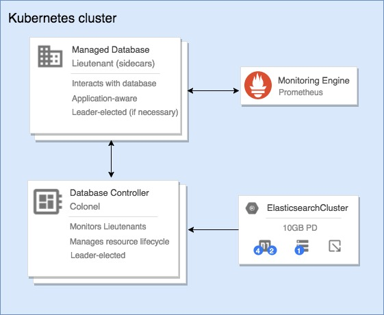

# Navigator - managed DBaaS on Kubernetes

## Please note this project is in a pre-alpha state, and still requires extensive integration, unit testing & health checks. Contributions are extremely welcome.

Navigator is a centralised controller for managing common stateful services on Kubernetes.
It provides a framework for building high-level resource types in Kubernetes by utilising
`ThirdPartyResource`s. It's conceptually similar to the `kube-controller-manager`, and is
responsible for managing sets of Kubernetes resources and adapting them accordingly in response
to change to resource spec changes.

Application specific logic is **not** coded into Navigator - instead it defers lifecycle management
for your applications to `pilots`. These `pilots` run as PID 1 within each of your
application containers. They are able to coordinate with each other, and perform application-level
actions in response to cluster events (eg. scale down, scale up, new nodes added, etc.), with assistance
gathering contextual information fromm the Navigator.

If you want to get going quickly, have a look at our [quick-start](docs/quick-start) guide!

## Architecture

## Supported applications

Whilst we aim to support as many common applications as possible, it does take a certain level of operational knowledge of the applications in question in order
to develop a pilot. Therefore, we'd like to reach out
to others that are interested in our efforts & would like to see a new application added (or existing one improved!).

Please search for or create an issue for the application in question you'd like to see a part of Navigator,
and we can begin discussion on implementation & planning.

| Name          | Version   | Status      | Notes                                                             |
| ------------- | --------- | ----------- | ----------------------------------------------------------------- |
| Elasticsearch | 5.x       | Alpha       | [more info](docs/supported-types/elasticsearch-cluster.md)  |
| Couchbase     |           | Coming soon |                                                                   |

## Links

* [Quick-start](docs/quick-start)
* [Resource types](docs/supported-types/README.md)
  * [ElasticsearchCluster](docs/supported-types/elasticsearch-cluster.md)

## Credits

James Munnelly, Christian Simon & Matt Bates of [Jetstack.io](https://www.jetstack.io/)
