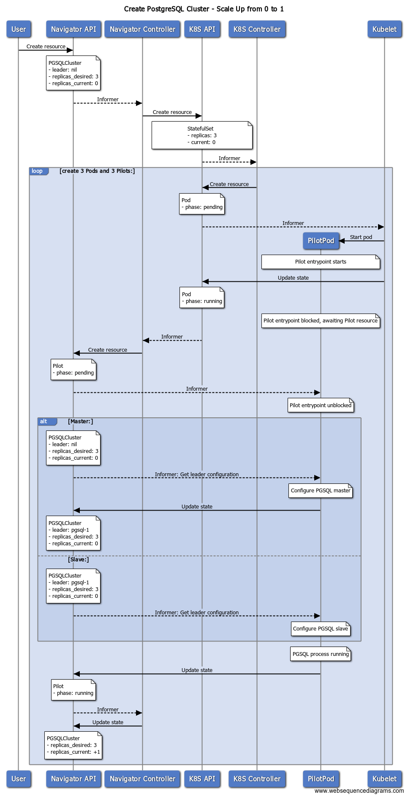

# Create a PostgreSQL Cluster (Warm Standby)

See https://www.postgresql.org/docs/9.1/static/warm-standby.html

1. Add standalone DB
2. Reconfigure as master
3. Add Standalone DB
4. Reconfigure as slave
5.

## Add standalone DB

## Reconfigure as Master
