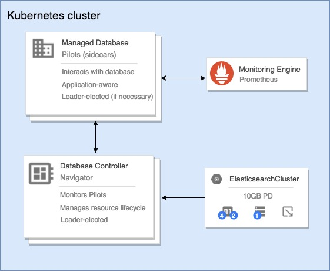

============================================
Navigator - self managed DBaaS on Kubernetes
============================================

Navigator is a Kubernetes extension for managing common stateful services on Kubernetes.
It is implemented as a custom apiserver that operates behind kube-aggregator and introduces a variety of new Kubernetes resource types.

As well as following "the operator model", Navigator additionally introduces the concept of 'Pilots' -
small 'nanny' processes that run inside each pod in your application deployment.
These Pilots are responsible for managing the lifecycle of your underlying application process (e.g. an Elasticsearch JVM process)
and periodically report state information about the individual node back to the Navigator API.

By separating this logic into it's own binary that is run alongside each node,
in certain failure events the Pilot is able to intervene in order to help prevent data loss,
or otherwise update the Navigator API with details of the failure so that navigator-controller can take action to restore service.

- **navigator-apiserver** - this takes on a similar role to ``kube-apiserver``.
  It is responsible for storing and coordinating all of the state stored for Navigator. It requires a connection to an etcd cluster in order to do this.
  In order to make Navigator API types generally consumable to users of your cluster,
  it registers itself with kube-aggregator.
  It performs validation of your resources, as well as performing conversions between API versions which allow us to maintain a stable API without hindering development.

- **navigator-controller** - the controller is akin to ``kube-controller-manager``.
  It is responsible for actually realizing your deployments within the Kubernetes cluster.
  It can be seen as the 'operator' for the various applications supported by ``navigator-apiserver``.

- **pilots** - the pilot is responsible for managing each database process.
  Currently Navigator has two types: ``pilot-elasticsearch`` and ``pilot-cassandra``.

.. toctree::
   :maxdepth: 2
   :caption: Contents:

   quick-start
   elasticsearch
   cassandra
   devel/index

Indices and tables
------------------

* :ref:`genindex`
* :ref:`search`
